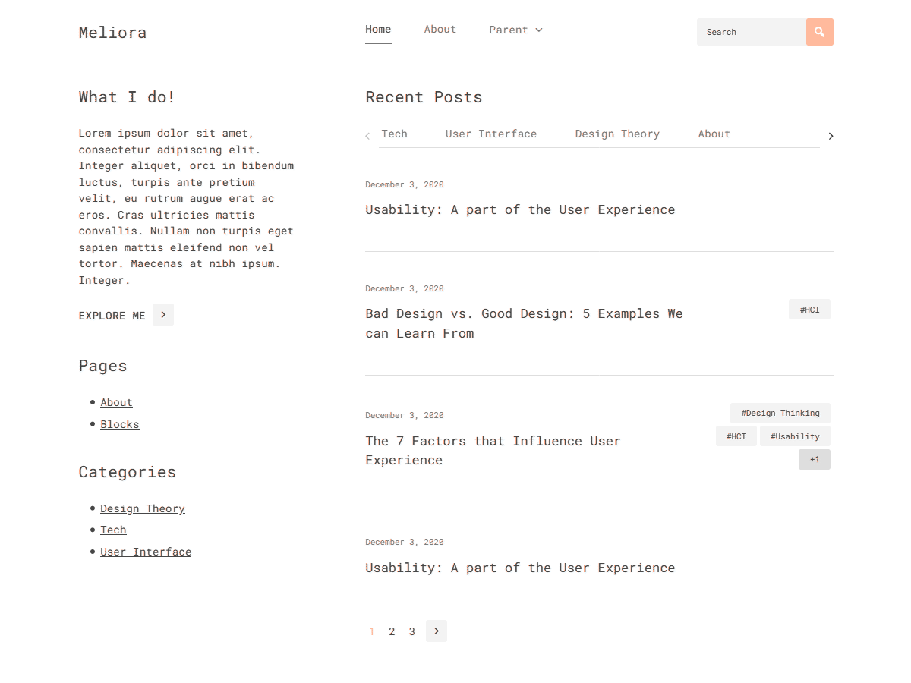

# WP-Meliora - [Demo](https://demo.vitathemes.com/meliora/) | [Download](https://wordpress.org/themes/wp-meliora/)
WP-Meliora is a minimal & mobile-first blog theme. The best choice for people who want to start blogging as soon as possible.




## Features
* No additional JS
* Sass for stylesheets
* Compatible with [Contact Form 7](https://wordpress.org/plugins/contact-form-7/)
* Fast & lightweight (Google Speed: 99/100)
* Theme options built directly into WordPress native live theme customizer
* Responsive design
* Cross-browser compatibility
* Custom Google WebFonts
* Child themes support
* Developer friendly extendable code
* Translation ready (with .POT files included)
* Right-to-left (RTL) languages support
* SEO optimized
* GNU GPL version 2.0 licensed
* …and much more

See a working example at [https://demo.vitathemes.com/meliora/](https://demo.vitathemes.com/meliora/).

## Theme installation
1. Simply install as a normal WordPress theme and activate.
2. In your admin panel, navigate to `Appearance > Customize`.
3. Put the finishing touches on your website by adding a logo, typography settings, custom colors and etc.

## Theme structure

```shell
themes/wp-meliora/        # → Root of your theme
│── css/                  # → Compiled CSS file
│── js/                   # → Theme js files
│── sass/                 # → Theme scss files
├── languages/            # → Theme Language files
├── template-parts/       # → Theme Part files (Include)
├── node_modules/         # → Node.js packages
├── vendor/               # → Third Party Packages (Managed by Composer, Currently we use [Kirki Framework](https://github.com/aristath/kirki) for customizer)
├── package.json          # → Node.js dependencies and scripts
│── classes/              # → Custom PHP classes
├── inc/                  # → Theme functions
│   ├── kirki/            # → Kirki Customization framework
│   ├── customizer.php    # → All codes related to WordPress Customizer (We use Kirki Framework)
│   ├── template-functions.php    # → Custom template tweaks
│   └── template-tags.php         # → Custom template tags
│   └── hooks.php         # → Theme custom hooks
└── page-templates/       # → Page Templates
```

## Theme setup

Edit `functions.php` to enable or disable theme features, setup navigation menus, post thumbnail sizes, and sidebars.

## Theme development

* Run `npm install` from the theme directory to install dependencies
* Run `npm run watch` from the root of theme directory and it's starting to watch any changes in scss files from the `sass` folder

## Contributing

Contributions are welcome from everyone. We have [contributing guidelines](CONTRIBUTING.md) to help you get started.

## Changelog

See the [Changelog](CHANGELOG.md)

## License

WP-Meliora is licensed under [GNU GPL](LICENSE).

## ❤️ Sponsors
<a href="" target="_blank"></a>

Want to become a sponsor? you can sponsor & support VitaThemes by providing our team your service for free!
